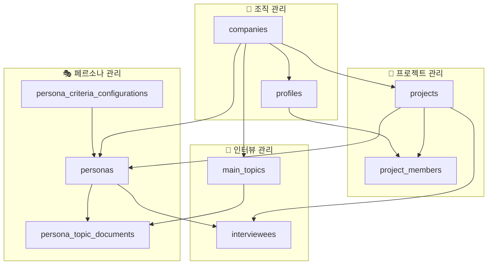

# Persona Insight Database ERD (Entity Relationship Diagram)

> 📅 생성일: 2025-06-19  
> 🔍 프로젝트: persona-insight-dev  
> 🗄️ 데이터베이스: Supabase PostgreSQL

## 📊 전체 데이터베이스 구조 개요

이 문서는 Persona Insight 플랫폼의 데이터베이스 테이블 구조와 관계를 상세히 설명합니다. 
현재 코드베이스에서 사용 중인 테이블만을 포함하며, 사용하지 않는 테이블(survey_sheets, workflows)은 제외했습니다.

### 🏗️ 주요 도메인 구조



---

## 🗂️ 테이블 상세 설명

### 1. 🏢 **companies** (회사)
> 다중 테넌트 구조의 최상위 조직 엔티티

| 컬럼명 | 타입 | 제약조건 | 설명 |
|--------|------|----------|------|
| **id** | `uuid` | PK, NOT NULL | 회사 고유 식별자 |
| name | `text` | NOT NULL | 회사명 |
| description | `text` | NULL | 회사 설명 |
| is_active | `boolean` | DEFAULT true | 활성화 상태 |
| domains | `text[]` | DEFAULT '{}' | 도메인 목록 (이메일 도메인 등) |
| created_at | `timestamptz` | DEFAULT now() | 생성일시 |
| updated_at | `timestamptz` | DEFAULT now() | 수정일시 |

**관계:**
- ↗️ profiles (1:N)
- ↗️ projects (1:N)
- ↗️ personas (1:N)
- ↗️ interviewees (1:N)
- ↗️ main_topics (1:N)
- ↗️ persona_criteria_configurations (1:N)

---

### 2. 👤 **profiles** (사용자 프로필)
> 시스템 사용자의 프로필 정보 및 권한 관리

| 컬럼명 | 타입 | 제약조건 | 설명 |
|--------|------|----------|------|
| **id** | `uuid` | PK, NOT NULL | 사용자 고유 식별자 (auth.users.id와 동일) |
| name | `text` | NOT NULL | 사용자 이름 |
| role | `user_role` | NOT NULL, DEFAULT 'company_user' | 사용자 권한<br/>• super_admin<br/>• company_admin<br/>• company_user |
| company_id | `uuid` | FK → companies.id | 소속 회사 |
| avatar_url | `text` | NULL | 프로필 이미지 URL |
| is_active | `boolean` | DEFAULT true | 활성화 상태 |
| last_login_at | `timestamptz` | NULL | 마지막 로그인 시간 |
| created_at | `timestamptz` | DEFAULT now() | 생성일시 |
| updated_at | `timestamptz` | DEFAULT now() | 수정일시 |

**관계:**
- ↘️ companies (N:1)
- ↘️ auth.users (1:1)
- ↗️ project_members (1:N)

---

### 3. 📁 **projects** (프로젝트)
> 인터뷰와 페르소나를 그룹화하는 프로젝트 단위

| 컬럼명 | 타입 | 제약조건 | 설명 |
|--------|------|----------|------|
| **id** | `uuid` | PK, NOT NULL | 프로젝트 고유 식별자 |
| name | `text` | NOT NULL | 프로젝트명 |
| description | `text` | NULL | 프로젝트 설명 |
| company_id | `uuid` | FK → companies.id, NOT NULL | 소속 회사 |
| created_by | `uuid` | FK → auth.users.id | 생성자 |
| master_id | `uuid` | FK → auth.users.id | 프로젝트 마스터 |
| visibility | `text` | DEFAULT 'public' | 가시성 (public/private) |
| join_method | `text` | DEFAULT 'open' | 참여 방법<br/>• open<br/>• invite_only<br/>• password |
| password | `text` | NULL | 참여 비밀번호 (join_method가 password일 때) |
| purpose | `text` | NULL | 프로젝트 목적 |
| target_audience | `text` | NULL | 대상 고객군 |
| research_method | `text` | NULL | 리서치 방법론 |
| start_date | `timestamptz` | NULL | 프로젝트 시작일 |
| end_date | `timestamptz` | NULL | 프로젝트 종료일 |
| is_active | `boolean` | DEFAULT true | 활성화 상태 |
| created_at | `timestamptz` | DEFAULT now() | 생성일시 |
| updated_at | `timestamptz` | DEFAULT now() | 수정일시 |

**관계:**
- ↘️ companies (N:1)
- ↘️ auth.users (created_by, master_id) (N:1)
- ↗️ project_members (1:N)
- ↗️ personas (1:N)
- ↗️ interviewees (1:N)
- ↗️ main_topics (1:N)
- ↗️ persona_criteria_configurations (1:N)

---

### 4. 👥 **project_members** (프로젝트 멤버)
> 프로젝트 참여자 및 권한 관리

| 컬럼명 | 타입 | 제약조건 | 설명 |
|--------|------|----------|------|
| **id** | `uuid` | PK, NOT NULL | 멤버십 고유 식별자 |
| project_id | `uuid` | FK → projects.id, NOT NULL | 프로젝트 ID |
| user_id | `uuid` | FK → profiles.id, NOT NULL | 사용자 ID |
| role | `text` | NOT NULL, DEFAULT 'member' | 프로젝트 내 역할<br/>• admin<br/>• member |
| joined_at | `timestamptz` | DEFAULT now() | 참여일시 |
| created_at | `timestamptz` | DEFAULT now() | 생성일시 |
| updated_at | `timestamptz` | DEFAULT now() | 수정일시 |

**관계:**
- ↘️ projects (N:1)
- ↘️ profiles (N:1)

---

### 5. 🎤 **interviewees** (인터뷰 대상자)
> 인터뷰 원본 데이터 및 분석 결과 저장

| 컬럼명 | 타입 | 제약조건 | 설명 |
|--------|------|----------|------|
| **id** | `uuid` | PK, NOT NULL | 인터뷰 고유 식별자 |
| session_date | `date` | NOT NULL | 인터뷰 날짜 |
| user_type | `text` | NOT NULL | 사용자 유형 |
| user_description | `text` | NULL | 사용자 설명 |
| interviewee_fake_name | `text` | NULL | 익명화된 인터뷰이 이름 |
| x_axis | `jsonb` | NULL | X축 분석 데이터 |
| y_axis | `jsonb` | NULL | Y축 분석 데이터 |
| interviewee_summary | `text` | NULL | 인터뷰 요약 |
| interviewee_style | `text` | NULL | 인터뷰이 스타일/특성 |
| interview_detail | `jsonb` | NULL | 인터뷰 상세 내용 (구조화된 데이터) |
| thumbnail | `text` | NULL | 썸네일 이미지 URL |
| company_id | `uuid` | FK → companies.id, NOT NULL | 소속 회사 |
| project_id | `uuid` | FK → projects.id | 소속 프로젝트 |
| created_by | `uuid` | FK → auth.users.id | 생성자 |
| persona_id | `uuid` | FK → personas.id | 연결된 페르소나 |
| persona_reflected | `boolean` | DEFAULT false | 페르소나에 반영 여부 |
| file_path | `text` | NULL | 파일 저장 경로 (interview-files 버킷) |
| created_at | `timestamptz` | DEFAULT now() | 생성일시 |
| updated_at | `timestamptz` | DEFAULT now() | 수정일시 |

**관계:**
- ↘️ companies (N:1)
- ↘️ projects (N:1)
- ↘️ auth.users (N:1)
- ↘️ personas (N:1)

---

### 6. 🎭 **personas** (페르소나)
> AI가 생성한 고객 페르소나 정보

| 컬럼명 | 타입 | 제약조건 | 설명 |
|--------|------|----------|------|
| **id** | `uuid` | PK, NOT NULL | 페르소나 고유 식별자 |
| persona_title | `text` | NULL | 페르소나 제목 (짧은 이름) |
| persona_type | `varchar` | NOT NULL | 페르소나 유형 |
| persona_description | `text` | NOT NULL | 페르소나 상세 설명 |
| persona_summary | `text` | NOT NULL | 페르소나 요약 |
| persona_style | `text` | NOT NULL | 페르소나 스타일/특성 |
| painpoints | `text` | NOT NULL | 주요 페인포인트 |
| needs | `text` | NOT NULL | 주요 니즈 |
| insight | `text` | NOT NULL | 핵심 인사이트 |
| insight_quote | `text` | NOT NULL | 대표 인용구 |
| thumbnail | `text` | NULL | 썸네일 이미지 URL |
| company_id | `uuid` | FK → companies.id, NOT NULL | 소속 회사 |
| project_id | `uuid` | FK → projects.id | 소속 프로젝트 |
| criteria_configuration_id | `uuid` | FK → persona_criteria_configurations.id | 분류 기준 설정 |
| x_min | `numeric` | DEFAULT 0 | X축 최소값 (0-100) |
| x_max | `numeric` | DEFAULT 100 | X축 최대값 (0-100) |
| y_min | `numeric` | DEFAULT 0 | Y축 최소값 (0-100) |
| y_max | `numeric` | DEFAULT 100 | Y축 최대값 (0-100) |
| matrix_position | `jsonb` | NULL | 매트릭스 위치 정보 {xIndex, yIndex} |
| active | `boolean` | DEFAULT true | 활성화 상태 |
| miso_dataset_id | `varchar` | NULL | MISO API 데이터셋 ID |
| created_at | `timestamptz` | DEFAULT now() | 생성일시 |
| updated_at | `timestamptz` | DEFAULT now() | 수정일시 |

**관계:**
- ↘️ companies (N:1)
- ↘️ projects (N:1)
- ↘️ persona_criteria_configurations (N:1)
- ↗️ interviewees (1:N)
- ↗️ persona_topic_documents (1:N)

---

### 7. 📊 **persona_criteria_configurations** (페르소나 분류 기준 설정)
> 페르소나 분류를 위한 2차원 매트릭스 기준 설정

| 컬럼명 | 타입 | 제약조건 | 설명 |
|--------|------|----------|------|
| **id** | `uuid` | PK, NOT NULL | 설정 고유 식별자 |
| project_id | `uuid` | FK → projects.id | 프로젝트 ID |
| company_id | `uuid` | FK → companies.id, NOT NULL | 회사 ID |
| x_axis | `jsonb` | NOT NULL | X축 설정<br/>• name: 축 이름<br/>• description: 설명<br/>• segments: 세그먼트 배열<br/>• low_end_label: 좌측 라벨<br/>• high_end_label: 우측 라벨 |
| y_axis | `jsonb` | NOT NULL | Y축 설정 (x_axis와 동일한 구조) |
| unclassified_cells | `jsonb` | DEFAULT '[]' | 미분류 셀 정보 |
| persona_matrix | `jsonb` | DEFAULT '{}' | 페르소나 매트릭스 매핑 |
| output_config | `jsonb` | NOT NULL | 출력 설정 |
| scoring_guidelines | `jsonb` | NOT NULL | 점수 산정 가이드라인 |
| is_active | `boolean` | DEFAULT true | 활성화 상태 |
| created_by | `uuid` | FK → auth.users.id | 생성자 |
| created_at | `timestamptz` | DEFAULT now() | 생성일시 |
| updated_at | `timestamptz` | DEFAULT now() | 수정일시 |

**관계:**
- ↘️ projects (N:1)
- ↘️ companies (N:1)
- ↘️ auth.users (N:1)
- ↗️ personas (1:N)

---

### 8. 🏷️ **main_topics** (주요 토픽)
> 회사/프로젝트별 추출된 주요 토픽

| 컬럼명 | 타입 | 제약조건 | 설명 |
|--------|------|----------|------|
| **id** | `uuid` | PK, NOT NULL | 토픽 고유 식별자 |
| topic_name | `text` | NOT NULL | 토픽명 |
| company_id | `uuid` | FK → companies.id, NOT NULL | 회사 ID |
| project_id | `uuid` | FK → projects.id | 프로젝트 ID |
| created_at | `timestamptz` | DEFAULT now() | 생성일시 |
| updated_at | `timestamptz` | DEFAULT now() | 수정일시 |

**관계:**
- ↘️ companies (N:1)
- ↘️ projects (N:1)
- ↗️ persona_topic_documents (1:N)

---

### 9. 📄 **persona_topic_documents** (페르소나-토픽 문서)
> 페르소나와 토픽 간의 관계 및 MISO 문서 연결

| 컬럼명 | 타입 | 제약조건 | 설명 |
|--------|------|----------|------|
| **id** | `uuid` | PK, NOT NULL | 문서 고유 식별자 |
| persona_id | `uuid` | FK → personas.id, NOT NULL | 페르소나 ID |
| topic_id | `uuid` | FK → main_topics.id, NOT NULL | 토픽 ID |
| miso_document_id | `varchar` | NOT NULL | MISO API 문서 ID |
| document_title | `text` | NULL | 문서 제목 |
| last_synced_at | `timestamptz` | NULL | 마지막 동기화 시간 |
| interview_count | `integer` | DEFAULT 0 | 관련 인터뷰 수 |
| created_at | `timestamptz` | DEFAULT now() | 생성일시 |
| updated_at | `timestamptz` | DEFAULT now() | 수정일시 |

**관계:**
- ↘️ personas (N:1)
- ↘️ main_topics (N:1)

---

## 🔑 주요 관계 및 제약사항

### 1. 인증 및 권한 체계
- `auth.users` (Supabase Auth) ↔ `profiles` (1:1 관계)
- 권한 계층: `super_admin` > `company_admin` > `company_user`
- 프로젝트 내 권한: `admin` > `member`

### 2. 다중 테넌트 구조
- 모든 주요 테이블은 `company_id`를 가지며 회사별로 데이터 격리
- RLS (Row Level Security) 활성화로 보안 강화

### 3. 데이터 흐름
```
인터뷰 파일 업로드 → interviewees 저장 → AI 분석 → personas 생성
                                    ↓
                              main_topics 추출
```

### 4. 프로젝트 중심 구조
- 프로젝트는 인터뷰와 페르소나를 그룹화하는 핵심 단위
- 프로젝트별 멤버 관리 및 권한 설정 가능

---

## 🚀 성능 최적화 고려사항

1. **인덱스 필요 컬럼**
   - 모든 외래 키 컬럼
   - `company_id`, `project_id` (다중 테넌트 쿼리)
   - `created_at`, `updated_at` (시간 기반 정렬)

2. **JSONB 최적화**
   - `interview_detail`, `x_axis`, `y_axis` 등 JSONB 컬럼은 GIN 인덱스 고려
   - 자주 쿼리되는 JSON 속성은 별도 컬럼으로 추출 검토

3. **파티셔닝 고려사항**
   - `interviewees` 테이블은 데이터 증가에 따라 날짜 기반 파티셔닝 고려

---

## 📝 참고사항

- 이 ERD는 2025-06-19 기준으로 작성되었습니다
- `survey_sheets`, `workflows` 테이블은 코드에서 사용되지 않아 제외했습니다
- `persona_topic_documents`는 제한적으로 사용되며, 향후 기능 확장 시 활용도가 높아질 수 있습니다