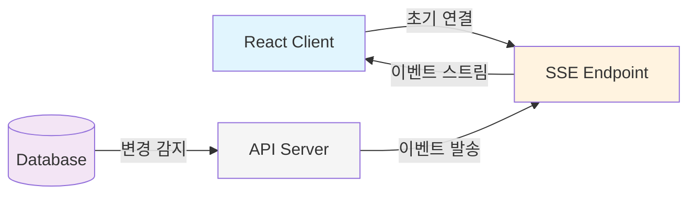
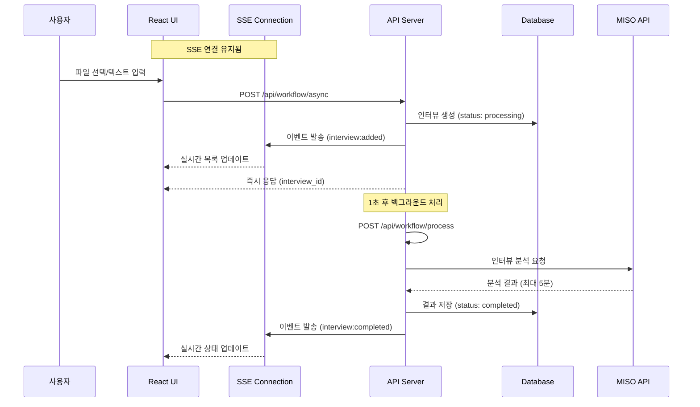
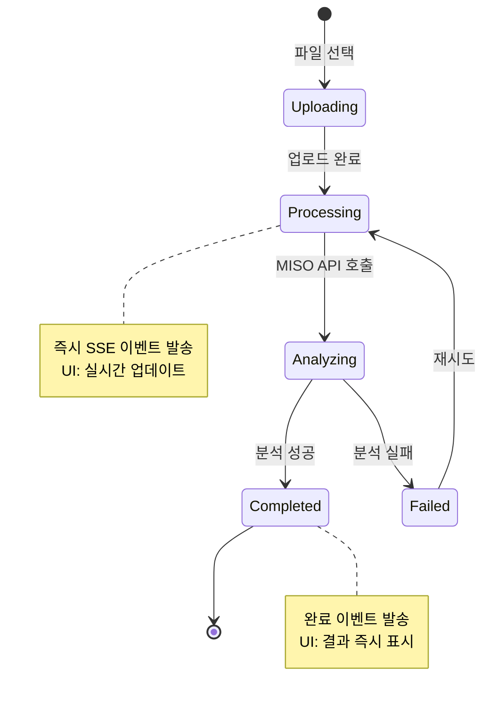

# Persona Insight Workflow Architecture

> 작성일: 2025-01-08
> 버전: 2.0 (SSE-based)

## 📋 목차
1. [개요](#개요)
2. [데이터 동기화 전략](#데이터-동기화-전략)
3. [인터뷰 업로드 워크플로우](#인터뷰-업로드-워크플로우)
4. [실시간 통신 패턴](#실시간-통신-패턴)
5. [시스템 아키텍처 도식](#시스템-아키텍처-도식)
6. [성능 특성](#성능-특성)

## 개요

Persona Insight는 **SSE (Server-Sent Events) 기반 실시간 아키텍처**를 채택하여 효율적인 실시간 업데이트를 제공합니다. 
네트워크 비용을 최소화하면서도 즉각적인 업데이트를 보장하는 설계입니다.

### 핵심 특징
- ✅ **SSE**: 실시간 이벤트 스트리밍 (데이터 동기화 & AI 응답)
- ✅ **Event-Driven**: 이벤트 기반 업데이트
- ❌ **Polling**: 제거됨 (네트워크 효율성)
- ❌ **WebSocket**: 불필요한 복잡성 회피

## 데이터 동기화 전략

### 1. SSE 기반 실시간 동기화 (주요 방식)



#### SSE 이벤트 종류
| 이벤트 | 타입 | 용도 |
|--------|------|------|
| 인터뷰 추가 | `interview:added` | 새 인터뷰 생성 시 |
| 처리 완료 | `interview:completed` | 분석 완료 시 |
| 처리 실패 | `interview:failed` | 분석 실패 시 |
| 상태 변경 | `interview:status_changed` | 상태 업데이트 |
| 인터뷰 삭제 | `interview:deleted` | 인터뷰 삭제 시 |

### 2. SSE 연결 관리

```typescript
// 클라이언트 연결 (use-sse-events.ts)
const eventSource = new EventSource(`/api/sse/projects/${projectId}`)

eventSource.onmessage = (event) => {
  const data = JSON.parse(event.data)
  // React Query 캐시 자동 업데이트
  queryClient.setQueryData(['interviews', projectId], ...)
}

// 자동 재연결 (5초 후)
eventSource.onerror = () => {
  setTimeout(() => connect(), 5000)
}
```

## 인터뷰 업로드 워크플로우

### 전체 프로세스 흐름도



### 상태 전이도



### API 엔드포인트 역할

```
┌─────────────────────────────────────────────────────────┐
│                    /api/workflow/async                   │
├─────────────────────────────────────────────────────────┤
│ • 파일 수신 및 검증                                      │
│ • DB 레코드 생성 (status: processing)                   │
│ • SSE 이벤트 발송 (interview:added) ⭐                  │
│ • 즉시 응답 반환                                        │
│ • 백그라운드 처리 트리거                                │
└─────────────────────────────────────────────────────────┘
                            ↓
┌─────────────────────────────────────────────────────────┐
│                   /api/workflow/process                  │
├─────────────────────────────────────────────────────────┤
│ • 프로젝트/회사 컨텍스트 로드                           │
│ • MISO API 호출 (blocking)                              │
│ • 분석 결과 파싱 및 DB 저장                             │
│ • SSE 이벤트 발송 (completed/failed) ⭐                 │
│ • 실패 시 에러 정보 포함                                │
└─────────────────────────────────────────────────────────┘
```

## 실시간 통신 패턴

### 1. SSE 이벤트 시스템 구조

```typescript
// 서버: 이벤트 발송 (lib/sse/events.ts)
export class InterviewEvents {
  static async emitInterviewAdded(projectId: string, interview: any) {
    await SSEManager.broadcast(projectId, {
      type: SSEEventType.INTERVIEW_ADDED,
      data: { interview }
    })
  }
  
  static async emitProcessingCompleted(projectId: string, interviewId: string, result: any) {
    await SSEManager.broadcast(projectId, {
      type: SSEEventType.INTERVIEW_PROCESSING_COMPLETED,
      data: { interviewId, result }
    })
  }
}

// 클라이언트: 이벤트 수신 (use-sse-events.ts)
const handleEvent = (event: MessageEvent) => {
  const data = JSON.parse(event.data)
  
  switch (data.type) {
    case SSEEventType.INTERVIEW_ADDED:
      // React Query 캐시에 새 인터뷰 추가
      queryClient.setQueryData(['interviews', projectId], ...)
      toast.success('새 인터뷰가 추가되었습니다')
      break
      
    case SSEEventType.INTERVIEW_PROCESSING_COMPLETED:
      // 인터뷰 상태 업데이트
      queryClient.setQueryData(['interviews', projectId], ...)
      toast.success('인터뷰 분석이 완료되었습니다')
      break
  }
}
```

### 2. AI 채팅 스트리밍 (SSE)

```typescript
// 동일한 SSE 인프라 활용
const streamChat = async (messages: ChatMessage[]) => {
  const response = await fetch('/api/chat', {
    method: 'POST',
    body: JSON.stringify({ messages })
  })
  
  // SSE 스트림 처리
  const reader = response.body?.getReader()
  while (true) {
    const { done, value } = await reader.read()
    if (done) break
    // 실시간 텍스트 렌더링
  }
}
```

## 시스템 아키텍처 도식

### 전체 아키텍처

```
┌─────────────────────────────────────────────────────────────────┐
│                         Frontend (Next.js)                       │
├─────────────────────────────────────────────────────────────────┤
│  ┌──────────────┐  ┌──────────────┐  ┌────────────────────┐   │
│  │ React Query  │  │ SSE Client   │  │  Event Handlers    │   │
│  │  (캐싱)      │  │ (EventSource)│  │  (자동 업데이트)    │   │
│  └──────────────┘  └──────────────┘  └────────────────────┘   │
└─────────────────────────────────────────────────────────────────┘
                              │
                              ↓ SSE Stream
┌─────────────────────────────────────────────────────────────────┐
│                      API Routes (Next.js)                        │
├─────────────────────────────────────────────────────────────────┤
│  ┌──────────────┐  ┌──────────────┐  ┌────────────────────┐   │
│  │ SSE Endpoint │  │ Event System │  │  Workflow APIs     │   │
│  │  /api/sse/*  │  │  (Emitters)  │  │   (Processors)     │   │
│  └──────────────┘  └──────────────┘  └────────────────────┘   │
└─────────────────────────────────────────────────────────────────┘
                              │
                    ┌─────────┴─────────┐
                    ↓                   ↓
┌─────────────────────────┐  ┌─────────────────────────┐
│      Supabase          │  │       MISO API          │
├─────────────────────────┤  ├─────────────────────────┤
│ • PostgreSQL DB        │  │ • Interview Analysis    │
│ • Authentication       │  │ • Persona Generation    │
│ • Row Level Security   │  │ • AI Chat Agent         │
│ • File Storage         │  │ • Knowledge Base        │
└─────────────────────────┘  └─────────────────────────┘
```

### 데이터 흐름 비교

```
━━━━━━━━━━━━━━━━━━━━━━━━━━━━━━━━━━━━━━━━━━━━━━━━━━━━━━━
  이전 시스템 (Polling)           현재 시스템 (SSE)
━━━━━━━━━━━━━━━━━━━━━━━━━━━━━━━━━━━━━━━━━━━━━━━━━━━━━━━
  Client → HTTP → Server         Client ← SSE ← Server
    ↑        ↓                     ↑              ↓
   30s      DB                   Event          DB
    └────────┘                     └──────────────┘
  (Polling Loop)                 (Push on Change)
━━━━━━━━━━━━━━━━━━━━━━━━━━━━━━━━━━━━━━━━━━━━━━━━━━━━━━━
```

## 성능 특성

### 장점 ✅
1. **실시간성**: 즉각적인 업데이트 (밀리초 단위)
2. **효율성**: 98% 네트워크 트래픽 감소
3. **UX**: 끊김 없는 실시간 경험
4. **확장성**: 이벤트 기반 아키텍처

### 성능 비교
```
┌─────────────────────────────────────┐
│         네트워크 효율성 비교         │
├─────────────────────────────────────┤
│ Polling (이전):                     │
│ • 사용자: 100명                     │
│ • 요청: 120회/시간/사용자           │
│ • 총 요청: 12,000/시간              │
│                                     │
│ SSE (현재):                         │
│ • 연결: 100개 (지속)                │
│ • 이벤트: ~100회/시간 (실제 변경시) │
│ • 98% 트래픽 감소 ✨                │
└─────────────────────────────────────┘
```

### SSE 연결 관리
```typescript
// SSE Manager (lib/sse/manager.ts)
class SSEManagerClass {
  // 프로젝트별 클라이언트 관리
  private clients: Map<string, Map<string, SSEClient>> = new Map()
  
  // Keep-alive: 30초마다 ping
  private startKeepAlive(projectId: string) {
    setInterval(() => {
      this.broadcast(projectId, { type: 'ping' })
    }, 30000)
  }
  
  // 자동 정리
  removeClient(projectId: string, clientId: string) {
    // 연결 종료 시 자동 정리
  }
}
```

## 주요 시나리오별 흐름

### 시나리오 1: 인터뷰 업로드 및 실시간 업데이트

```
시간 →
00:00 ┌─────┐ 파일 업로드
      │ 👤A │ ────────────→ [Upload API]
      └─────┘                     ↓
                            [SSE: interview:added]
                                  ↓
00:00.1 ┌─────┐            즉시 목록 갱신 ✨
        │ 👤B │ ←──────────
        └─────┘
                            [백그라운드 처리중...]
                                  ↓
00:45 ┌─────┐              
      │ 👤A │ ←────────── [SSE: interview:completed]
      └─────┘                     
      ┌─────┐              동시 업데이트 ✨
      │ 👤B │ ←──────────
      └─────┘
```

### 시나리오 2: 다중 사용자 실시간 협업

```
User A                    Server                    User B
  │                         │                         │
  ├─── 인터뷰 추가 ────────→│                         │
  │                         ├─── DB 저장              │
  │                         ├─── SSE 이벤트 ─────────→│
  │←─── 목록 갱신 ──────────┤                    (즉시 반영)
  │                         │                         │
  │                    (실시간 동기화)                │
```

### 시나리오 3: 연결 복구 및 상태 동기화

```
연결 끊김 → 5초 후 자동 재연결 → 초기 데이터 로드 → SSE 재구독
     ↓
일시적 오프라인
     ↓
복구 시 놓친 이벤트는 초기 로드로 보완
```

## 기술 스택별 역할

```
┌────────────────────────────────────────────────────┐
│                  Frontend 기술                      │
├────────────────────────────────────────────────────┤
│ • EventSource API: SSE 클라이언트                  │
│ • React Query: 캐시 관리 및 초기 데이터 로드       │
│ • Custom Hooks: SSE 이벤트 처리 로직              │
│ • Auto-reconnect: 연결 복구 로직                  │
└────────────────────────────────────────────────────┘

┌────────────────────────────────────────────────────┐
│                  Backend 기술                       │
├────────────────────────────────────────────────────┤
│ • SSE Endpoints: 실시간 스트림 제공               │
│ • Event System: 구조화된 이벤트 발송              │
│ • Connection Manager: 클라이언트 연결 관리         │
│ • Keep-alive: 연결 유지 메커니즘                  │
└────────────────────────────────────────────────────┘
```

## 모니터링 포인트

### 주요 지표
- **활성 연결 수**: 프로젝트별 SSE 연결
- **이벤트 처리량**: 초당 이벤트 수
- **연결 안정성**: 재연결 빈도
- **레이턴시**: 이벤트 발생-수신 시간

### 디버깅 도구
```typescript
// SSE 연결 상태 모니터링
const SSEDebugger = {
  connections: new Map(),
  events: [],
  
  logConnection: (projectId: string, status: string) => {
    console.log(`[SSE] Project ${projectId}: ${status}`)
  },
  
  logEvent: (type: string, data: any) => {
    console.log(`[SSE Event] ${type}:`, data)
  }
}
```

## 결론

Persona Insight는 **완전한 SSE 기반 실시간 아키텍처**로 전환되어,
네트워크 효율성과 사용자 경험을 크게 개선했습니다. 

### 핵심 정리
- 📡 **SSE**: 모든 실시간 업데이트 (데이터 & AI)
- 🚀 **즉시 반영**: 밀리초 단위 업데이트
- 💰 **98% 비용 절감**: 네트워크 트래픽 최소화
- 🔄 **자동 복구**: 연결 끊김 시 자동 재연결

이 아키텍처는 **"Efficient Real-time"** 철학을 따르며,
단순하면서도 강력한 실시간 시스템을 구축했습니다.