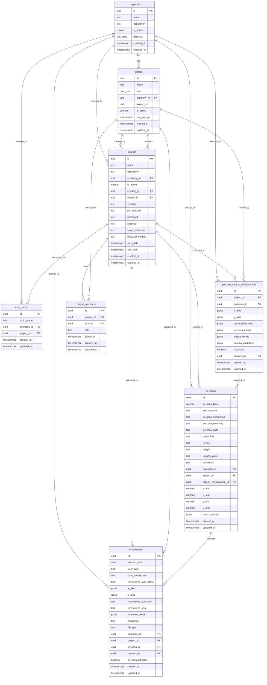

# Persona Insight Platform - Database ERD 문서

## 📋 목차
1. [데이터베이스 개요](#데이터베이스-개요)
2. [테이블별 상세 구조](#테이블별-상세-구조)
3. [관계 다이어그램](#관계-다이어그램)
4. [인덱스 및 제약조건](#인덱스-및-제약조건)
5. [데이터 타입 설명](#데이터-타입-설명)

---

## 🗄️ 데이터베이스 개요

**Persona Insight** 플랫폼은 PostgreSQL 기반의 Supabase를 사용하며, 다중 테넌트 아키텍처로 설계되었습니다.

### 핵심 설계 원칙
- **다중 테넌트**: `company_id`를 통한 데이터 격리
- **권한 기반 접근**: Row Level Security (RLS) 정책 적용
- **확장성**: JSONB 필드를 활용한 유연한 데이터 구조
- **감사 추적**: 모든 테이블에 `created_at`, `updated_at` 타임스탬프

---

## 📊 테이블별 상세 구조

### 1. companies (회사 정보)
**목적**: 다중 테넌트 아키텍처의 최상위 엔티티

| 컬럼명 | 데이터 타입 | Null 허용 | 기본값 | 키 타입 | 설명 |
|--------|-------------|-----------|--------|---------|------|
| id | uuid | NO | gen_random_uuid() | PRIMARY KEY | 회사 고유 식별자 |
| name | text | NO | - | - | 회사명 |
| description | text | YES | - | - | 회사 설명 |
| is_active | boolean | YES | true | - | 활성 상태 |
| created_at | timestamptz | YES | now() | - | 생성 일시 |
| updated_at | timestamptz | YES | now() | - | 수정 일시 |
| domains | text[] | YES | '{}' | - | 허용 도메인 목록 (이메일 제한용) |

**비즈니스 규칙**:
- 회사별 데이터 격리의 핵심 테이블
- `domains` 배열로 회사 이메일 도메인 제한 관리
- `is_active=false`시 해당 회사의 모든 사용자 접근 차단

---

### 2. profiles (사용자 프로필)
**목적**: 사용자 기본 정보 및 권한 관리

| 컬럼명 | 데이터 타입 | Null 허용 | 기본값 | 키 타입 | 설명 |
|--------|-------------|-----------|--------|---------|------|
| id | uuid | NO | - | PRIMARY KEY | Supabase Auth 사용자 ID와 연동 |
| name | text | NO | - | - | 사용자 이름 |
| role | user_role | NO | 'company_user' | - | 사용자 권한 (enum) |
| company_id | uuid | YES | - | FOREIGN KEY → companies.id | 소속 회사 |
| avatar_url | text | YES | - | - | 프로필 이미지 URL |
| is_active | boolean | YES | true | - | 계정 활성 상태 |
| last_login_at | timestamptz | YES | - | - | 마지막 로그인 시간 |
| created_at | timestamptz | YES | now() | - | 계정 생성 일시 |
| updated_at | timestamptz | YES | now() | - | 프로필 수정 일시 |

**ENUM 타입 - user_role**:
- `super_admin`: 시스템 관리자 (모든 회사 접근)
- `company_admin`: 회사 관리자 (해당 회사 내 모든 권한)
- `company_user`: 일반 사용자 (제한된 권한)

**비즈니스 규칙**:
- Supabase Auth의 `auth.users` 테이블과 1:1 관계
- `company_id`가 NULL인 경우 super_admin만 가능
- `is_active=false`시 로그인 차단

---

### 3. projects (프로젝트)
**목적**: 협업 단위의 프로젝트 관리

| 컬럼명 | 데이터 타입 | Null 허용 | 기본값 | 키 타입 | 설명 |
|--------|-------------|-----------|--------|---------|------|
| id | uuid | NO | gen_random_uuid() | PRIMARY KEY | 프로젝트 고유 식별자 |
| name | text | NO | - | - | 프로젝트명 |
| description | text | YES | - | - | 프로젝트 설명 |
| company_id | uuid | NO | - | FOREIGN KEY → companies.id | 소속 회사 |
| is_active | boolean | YES | true | - | 프로젝트 활성 상태 |
| created_at | timestamptz | YES | now() | - | 생성 일시 |
| updated_at | timestamptz | YES | now() | - | 수정 일시 |
| created_by | uuid | YES | - | FOREIGN KEY → auth.users.id | 생성자 |
| master_id | uuid | YES | - | FOREIGN KEY → auth.users.id | 프로젝트 마스터 |
| visibility | text | YES | 'public' | - | 공개 여부 (public/private) |
| join_method | text | YES | 'open' | - | 참여 방식 (open/invite_only/password) |
| password | text | YES | - | - | 참여 비밀번호 (join_method=password시) |
| purpose | text | YES | - | - | 프로젝트 목적 |
| target_audience | text | YES | - | - | 타겟 오디언스 |
| research_method | text | YES | - | - | 리서치 방법론 |
| start_date | timestamptz | YES | - | - | 프로젝트 시작일 |
| end_date | timestamptz | YES | - | - | 프로젝트 종료일 |

**체크 제약조건**:
- `visibility IN ('public', 'private')`
- `join_method IN ('open', 'invite_only', 'password')`

**비즈니스 규칙**:
- 회사 내 팀 협업의 기본 단위
- `master_id`는 프로젝트의 최종 책임자
- `join_method=password`시 `password` 필드 필수

---

### 4. project_members (프로젝트 멤버십)
**목적**: 프로젝트별 사용자 권한 관리

| 컬럼명 | 데이터 타입 | Null 허용 | 기본값 | 키 타입 | 설명 |
|--------|-------------|-----------|--------|---------|------|
| id | uuid | NO | gen_random_uuid() | PRIMARY KEY | 멤버십 고유 식별자 |
| project_id | uuid | NO | - | FOREIGN KEY → projects.id | 프로젝트 ID |
| user_id | uuid | NO | - | FOREIGN KEY → profiles.id | 사용자 ID |
| role | text | NO | 'member' | - | 프로젝트 내 역할 |
| joined_at | timestamptz | YES | now() | - | 참여 일시 |
| created_at | timestamptz | YES | now() | - | 레코드 생성 일시 |
| updated_at | timestamptz | YES | now() | - | 레코드 수정 일시 |

**체크 제약조건**:
- `role IN ('owner', 'admin', 'member')`

**비즈니스 규칙**:
- 한 사용자는 하나의 프로젝트에 하나의 역할만 가질 수 있음
- `owner`: 프로젝트 삭제 권한
- `admin`: 멤버 관리 및 설정 변경 권한
- `member`: 데이터 조회 및 기본 작업 권한

---

### 5. persona_criteria_configurations (페르소나 분류 기준)
**목적**: AI 기반 페르소나 분류를 위한 설정 관리

| 컬럼명 | 데이터 타입 | Null 허용 | 기본값 | 키 타입 | 설명 |
|--------|-------------|-----------|--------|---------|------|
| id | uuid | NO | gen_random_uuid() | PRIMARY KEY | 설정 고유 식별자 |
| project_id | uuid | YES | - | FOREIGN KEY → projects.id | 프로젝트 ID (NULL=회사 전체) |
| company_id | uuid | NO | - | FOREIGN KEY → companies.id | 회사 ID |
| x_axis | jsonb | NO | 기본 X축 설정 | - | X축 분류 기준 |
| y_axis | jsonb | NO | 기본 Y축 설정 | - | Y축 분류 기준 |
| unclassified_cells | jsonb | NO | '[]' | - | 분류 제외 영역 |
| persona_matrix | jsonb | NO | '{}' | - | 페르소나 매트릭스 설정 |
| output_config | jsonb | NO | 기본 출력 설정 | - | AI 출력 필드 매핑 |
| scoring_guidelines | jsonb | NO | 기본 스코어링 가이드 | - | 점수 부여 가이드라인 |
| is_active | boolean | YES | true | - | 설정 활성 상태 |
| created_at | timestamptz | YES | now() | - | 생성 일시 |
| updated_at | timestamptz | YES | now() | - | 수정 일시 |
| created_by | uuid | YES | - | FOREIGN KEY → auth.users.id | 생성자 |

**JSONB 필드 구조**:

**x_axis / y_axis**:
```json
{
  "name": "축 이름",
  "description": "축 설명",
  "low_end_label": "저점 라벨",
  "high_end_label": "고점 라벨",
  "segments": [
    {
      "name": "세그먼트명",
      "description": "세그먼트 설명",
      "is_unclassified": false
    }
  ]
}
```

**output_config**:
```json
{
  "x_low_score_field": "x_low_score",
  "x_high_score_field": "x_high_score",
  "y_low_score_field": "y_low_score", 
  "y_high_score_field": "y_high_score",
  "x_axis_variable_name": "x_axis_scores",
  "y_axis_variable_name": "y_axis_scores"
}
```

---

### 6. personas (페르소나)
**목적**: AI가 생성한 고객 페르소나 정보

| 컬럼명 | 데이터 타입 | Null 허용 | 기본값 | 키 타입 | 설명 |
|--------|-------------|-----------|--------|---------|------|
| id | uuid | NO | gen_random_uuid() | PRIMARY KEY | 페르소나 고유 식별자 |
| persona_type | varchar(10) | NO | - | - | 페르소나 유형 (짧은 분류명) |
| persona_title | text | YES | - | - | 페르소나 제목 |
| persona_description | text | NO | - | - | 상세 설명 |
| persona_summary | text | NO | - | - | 요약 |
| persona_style | text | NO | - | - | 대화 스타일 |
| painpoints | text | NO | - | - | 고객 페인 포인트 |
| needs | text | NO | - | - | 고객 니즈 |
| insight | text | NO | - | - | 핵심 인사이트 |
| insight_quote | text | NO | - | - | 대표 인용구 |
| thumbnail | text | YES | - | - | 썸네일 이미지 URL |
| company_id | uuid | NO | - | FOREIGN KEY → companies.id | 소속 회사 |
| project_id | uuid | YES | - | FOREIGN KEY → projects.id | 소속 프로젝트 |
| criteria_configuration_id | uuid | YES | - | FOREIGN KEY → persona_criteria_configurations.id | 사용된 분류 기준 |
| x_min | numeric | YES | 0 | - | X축 최소값 (0-100) |
| x_max | numeric | YES | 100 | - | X축 최대값 (0-100) |
| y_min | numeric | YES | 0 | - | Y축 최소값 (0-100) |
| y_max | numeric | YES | 100 | - | Y축 최대값 (0-100) |
| matrix_position | jsonb | YES | - | - | 매트릭스 위치 정보 |
| created_at | timestamptz | YES | now() | - | 생성 일시 |
| updated_at | timestamptz | YES | now() | - | 수정 일시 |

**JSONB 필드 구조**:

**matrix_position**:
```json
{
  "xIndex": 2,
  "yIndex": 1,
  "xScore": 75.5,
  "yScore": 32.8
}
```

**비즈니스 규칙**:
- 좌표 범위는 0-100으로 제한
- `project_id`가 NULL인 경우 회사 전체 공통 페르소나
- AI 채팅 시 `persona_style` 필드로 대화 톤 결정

---

### 7. interviewees (인터뷰 대상자)
**목적**: 업로드된 인터뷰 파일과 AI 분석 결과

| 컬럼명 | 데이터 타입 | Null 허용 | 기본값 | 키 타입 | 설명 |
|--------|-------------|-----------|--------|---------|------|
| id | uuid | NO | gen_random_uuid() | PRIMARY KEY | 인터뷰 고유 식별자 |
| session_date | date | NO | - | - | 인터뷰 세션 날짜 |
| user_type | text | NO | - | - | 사용자 유형 분류 |
| user_description | text | YES | - | - | 사용자 설명 |
| interviewee_fake_name | text | YES | - | - | 가명 (개인정보 보호) |
| x_axis | jsonb | YES | - | - | X축 분석 결과 |
| y_axis | jsonb | YES | - | - | Y축 분석 결과 |
| interviewee_summary | text | YES | - | - | 인터뷰 요약 |
| interviewee_style | text | YES | - | - | 인터뷰 대상자 특성 |
| interview_detail | jsonb | YES | - | - | 상세 분석 결과 |
| thumbnail | text | YES | - | - | 썸네일 이미지 URL |
| file_path | text | YES | - | - | 원본 파일 경로 (Supabase Storage) |
| company_id | uuid | NO | - | FOREIGN KEY → companies.id | 소속 회사 |
| project_id | uuid | YES | - | FOREIGN KEY → projects.id | 소속 프로젝트 |
| persona_id | uuid | YES | - | FOREIGN KEY → personas.id | 매칭된 페르소나 |
| created_by | uuid | YES | - | FOREIGN KEY → auth.users.id | 업로드한 사용자 |
| persona_reflected | boolean | YES | false | - | 페르소나 반영 여부 |
| created_at | timestamptz | YES | now() | - | 업로드 일시 |
| updated_at | timestamptz | YES | now() | - | 수정 일시 |

**JSONB 필드 구조**:

**x_axis / y_axis**:
```json
{
  "score": 75.2,
  "confidence": 0.85,
  "reasoning": "분석 근거 텍스트"
}
```

**interview_detail**:
```json
{
  "topics": ["사용성", "가격", "브랜드"],
  "sentiment": "positive",
  "key_quotes": ["정말 좋아요", "가격이 비싸요"],
  "demographics": {
    "age_group": "30-40",
    "occupation": "직장인",
    "location": "서울"
  },
  "behavior_patterns": ["모바일 선호", "가격 민감"],
  "pain_points": ["복잡한 UI", "느린 속도"]
}
```

**비즈니스 규칙**:
- `file_path`는 Supabase Storage의 `interview-files` 버킷 경로
- `persona_reflected=true`시 해당 인터뷰가 페르소나에 반영됨
- AI 분석 후 자동으로 적절한 `persona_id`에 매칭

---

### 8. main_topics (주요 토픽)
**목적**: 회사별 추출된 주요 토픽 관리

| 컬럼명 | 데이터 타입 | Null 허용 | 기본값 | 키 타입 | 설명 |
|--------|-------------|-----------|--------|---------|------|
| id | uuid | NO | gen_random_uuid() | PRIMARY KEY | 토픽 고유 식별자 |
| topic_name | text | NO | - | - | 토픽명 |
| company_id | uuid | NO | - | FOREIGN KEY → companies.id | 소속 회사 |
| project_id | uuid | YES | - | FOREIGN KEY → projects.id | 소속 프로젝트 (NULL=전체) |
| created_at | timestamptz | YES | now() | - | 생성 일시 |
| updated_at | timestamptz | YES | now() | - | 수정 일시 |

**비즈니스 규칙**:
- 중복 토픽은 자동으로 병합됨
- AI 채팅 시 컨텍스트로 활용
- `project_id=NULL`인 경우 회사 전체 공통 토픽

---

## 🔗 관계 다이어그램

### 데이터베이스 관계 구조



---

## 🔑 인덱스 및 제약조건

### 기본 키 (Primary Keys)
모든 테이블에 UUID 타입의 기본 키가 설정되어 있습니다.

### 외래 키 제약조건 (Foreign Key Constraints)

| 테이블 | 컬럼 | 참조 테이블 | 참조 컬럼 | 삭제 정책 |
|--------|------|-------------|-----------|-----------|
| profiles | company_id | companies | id | RESTRICT |
| profiles | id | auth.users | id | CASCADE |
| projects | company_id | companies | id | RESTRICT |
| projects | created_by | auth.users | id | SET NULL |
| projects | master_id | auth.users | id | SET NULL |
| project_members | project_id | projects | id | CASCADE |
| project_members | user_id | profiles | id | CASCADE |
| persona_criteria_configurations | project_id | projects | id | CASCADE |
| persona_criteria_configurations | company_id | companies | id | RESTRICT |
| persona_criteria_configurations | created_by | auth.users | id | SET NULL |
| personas | company_id | companies | id | RESTRICT |
| personas | project_id | projects | id | SET NULL |
| personas | criteria_configuration_id | persona_criteria_configurations | id | SET NULL |
| interviewees | company_id | companies | id | RESTRICT |
| interviewees | project_id | projects | id | SET NULL |
| interviewees | persona_id | personas | id | SET NULL |
| interviewees | created_by | auth.users | id | SET NULL |
| main_topics | company_id | companies | id | RESTRICT |
| main_topics | project_id | projects | id | CASCADE |

### 체크 제약조건 (Check Constraints)

| 테이블 | 컬럼 | 제약조건 |
|--------|------|----------|
| profiles | role | role IN ('super_admin', 'company_admin', 'company_user') |
| projects | visibility | visibility IN ('public', 'private') |
| projects | join_method | join_method IN ('open', 'invite_only', 'password') |
| project_members | role | role IN ('owner', 'admin', 'member') |
| personas | x_min, x_max, y_min, y_max | 0 <= value <= 100 |

### 고유 제약조건 (Unique Constraints)

| 테이블 | 컬럼 조합 | 설명 |
|--------|-----------|------|
| project_members | (project_id, user_id) | 한 사용자는 프로젝트당 하나의 역할만 |
| main_topics | (company_id, topic_name) | 회사별 토픽명 중복 방지 |

### 인덱스 (Indexes)

**성능 최적화를 위한 인덱스**:

```sql
-- 다중 테넌트 쿼리 최적화
CREATE INDEX idx_personas_company_id ON personas(company_id);
CREATE INDEX idx_interviewees_company_id ON interviewees(company_id);
CREATE INDEX idx_projects_company_id ON projects(company_id);

-- 프로젝트별 데이터 조회 최적화
CREATE INDEX idx_personas_project_id ON personas(project_id);
CREATE INDEX idx_interviewees_project_id ON interviewees(project_id);

-- 페르소나 매칭 최적화
CREATE INDEX idx_interviewees_persona_id ON interviewees(persona_id);

-- 시간 기반 쿼리 최적화
CREATE INDEX idx_interviewees_session_date ON interviewees(session_date);
CREATE INDEX idx_personas_created_at ON personas(created_at);

-- JSONB 필드 인덱스 (필요시)
CREATE INDEX idx_persona_criteria_x_axis ON persona_criteria_configurations USING GIN (x_axis);
CREATE INDEX idx_persona_criteria_y_axis ON persona_criteria_configurations USING GIN (y_axis);
```

---

## 🏗️ Row Level Security (RLS) 정책

### 다중 테넌트 보안 정책

```sql
-- companies 테이블 RLS
ALTER TABLE companies ENABLE ROW LEVEL SECURITY;
CREATE POLICY company_access ON companies
  FOR ALL USING (
    -- super_admin은 모든 회사 접근 가능
    auth.jwt() ->> 'role' = 'super_admin'
    OR
    -- 해당 회사 소속 사용자만 접근 가능
    id = (SELECT company_id FROM profiles WHERE id = auth.uid())
  );

-- profiles 테이블 RLS
ALTER TABLE profiles ENABLE ROW LEVEL SECURITY;
CREATE POLICY profile_access ON profiles
  FOR ALL USING (
    -- 본인 프로필은 항상 접근 가능
    id = auth.uid()
    OR
    -- 같은 회사 사용자끼리 조회 가능
    company_id = (SELECT company_id FROM profiles WHERE id = auth.uid())
    OR
    -- super_admin은 모든 프로필 접근 가능
    (SELECT role FROM profiles WHERE id = auth.uid()) = 'super_admin'
  );

-- projects 테이블 RLS
ALTER TABLE projects ENABLE ROW LEVEL SECURITY;
CREATE POLICY project_access ON projects
  FOR ALL USING (
    -- 같은 회사 내 프로젝트만 접근
    company_id = (SELECT company_id FROM profiles WHERE id = auth.uid())
    OR
    -- super_admin은 모든 프로젝트 접근 가능
    (SELECT role FROM profiles WHERE id = auth.uid()) = 'super_admin'
  );

-- 다른 테이블들도 동일한 패턴으로 RLS 적용
```

---

## 📈 성능 고려사항

### 1. 쿼리 최적화 패턴

**다중 테넌트 쿼리**:
```sql
-- 올바른 패턴: company_id를 WHERE 절에 포함
SELECT * FROM personas 
WHERE company_id = $1 AND persona_type LIKE '%search%';

-- 잘못된 패턴: company_id 누락 (전체 테이블 스캔)
SELECT * FROM personas 
WHERE persona_type LIKE '%search%';
```

**JSONB 쿼리 최적화**:
```sql
-- GIN 인덱스 활용
SELECT * FROM persona_criteria_configurations 
WHERE x_axis @> '{"name": "기술 수용도"}';

-- JSONB 경로 쿼리
SELECT * FROM interviewees 
WHERE interview_detail -> 'demographics' ->> 'age_group' = '30-40';
```

### 2. 파티셔닝 전략 (확장성)

**시간 기반 파티셔닝**:
```sql
-- 인터뷰 데이터의 월별 파티셔닝 (대용량 처리시)
CREATE TABLE interviewees_y2024m01 
PARTITION OF interviewees 
FOR VALUES FROM ('2024-01-01') TO ('2024-02-01');
```

**회사별 파티셔닝**:
```sql
-- 회사별 파티셔닝 (극대규모시)
CREATE TABLE personas_company_a 
PARTITION OF personas 
FOR VALUES IN ('company-uuid-a');
```

### 3. 캐싱 전략

**Redis 캐시 키 패턴**:
```
personas:company:{company_id}:list
personas:company:{company_id}:project:{project_id}:list
main_topics:company:{company_id}
user:profile:{user_id}
```

---

## 🔄 데이터 마이그레이션 및 시더

### 초기 데이터 설정

```sql
-- 시스템 관리자 회사 생성
INSERT INTO companies (id, name, description) 
VALUES ('00000000-0000-0000-0000-000000000000', 'System', 'System Administrator Company');

-- 기본 페르소나 분류 기준 생성
INSERT INTO persona_criteria_configurations (
  company_id, 
  x_axis, 
  y_axis,
  is_active
) VALUES (
  '회사-UUID',
  '{"name": "기술 수용도", "description": "새로운 기술에 대한 개방성", ...}',
  '{"name": "가격 민감도", "description": "가격에 대한 민감도", ...}',
  true
);
```

### 데이터 정합성 검증

```sql
-- 고아 레코드 확인
SELECT COUNT(*) FROM personas p 
LEFT JOIN companies c ON p.company_id = c.id 
WHERE c.id IS NULL;

-- 페르소나 좌표 범위 검증
SELECT COUNT(*) FROM personas 
WHERE x_min < 0 OR x_max > 100 OR y_min < 0 OR y_max > 100;

-- 프로젝트 멤버십 일관성 검증
SELECT COUNT(*) FROM project_members pm
LEFT JOIN projects p ON pm.project_id = p.id
LEFT JOIN profiles pr ON pm.user_id = pr.id
WHERE p.id IS NULL OR pr.id IS NULL;
```

---

이 ERD 문서는 Persona Insight 플랫폼의 완전한 데이터베이스 구조를 제공하며, 개발자가 효율적인 쿼리 작성과 데이터 모델링을 할 수 있도록 지원합니다.