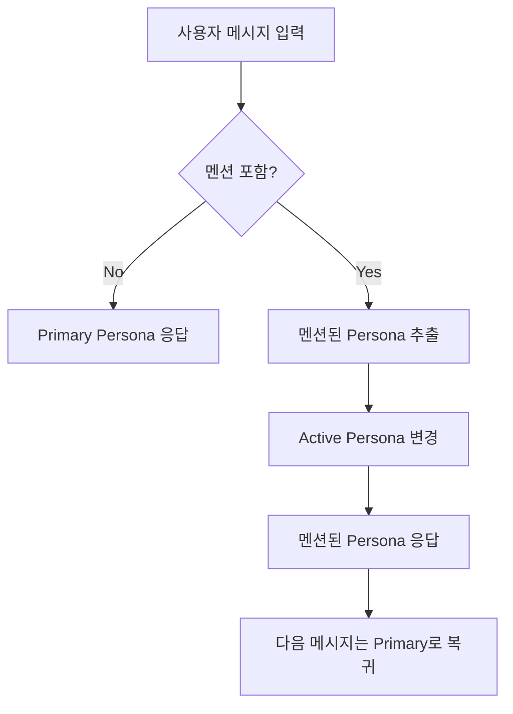

# Multi-Persona 채팅 시스템 구현 계획

## 📋 개요

현재 채팅창에서 다른 페르소나를 멘션할 때, 새로운 대화창을 생성하지 않고 **기존 대화 컨텍스트를 유지**하면서 멘션된 페르소나가 해당 메시지에만 응답하는 시스템입니다.

## 🎯 핵심 기능

### 1. **컨텍스트 유지 멘션 응답**
- 페르소나 A와 대화 중 페르소나 B를 멘션하면
- **동일한 대화창**에서 페르소나 B가 응답
- **MISO Conversation ID 유지**로 대화 히스토리 보존
- 멘션이 없는 다음 메시지는 다시 페르소나 A가 응답

### 2. **자연스러운 UI 흐름**
- 대화창 초기화 없음
- 응답자만 페르소나 아바타/이름으로 구분
- 기존 메시지 히스토리 완전 보존

## 🏗️ 시스템 아키텍처

### A. 상태 관리 구조

```typescript
interface MultiPersonaState {
  // 기본 페르소나 (대화창의 주인)
  primaryPersona: PersonaData
  
  // 현재 활성 페르소나 (마지막으로 응답할 페르소나)
  activePersona: PersonaData
  
  // MISO Conversation ID (전체 대화 공유)
  misoConversationId: string
  
  // 각 페르소나별 메시지 히스토리 (컨텍스트용)
  personaContexts: {
    [personaId: string]: {
      messages: Message[]
      lastActiveAt: Date
    }
  }
}
```

### B. 메시지 구조 확장

```typescript
interface ExtendedMessage extends Message {
  // 응답한 페르소나 정보
  respondingPersona?: {
    id: string
    name: string
    image?: string
  }
  
  // 멘션된 페르소나들
  mentionedPersonas?: string[]
  
  // 원본 메시지 (멘션 포함)
  rawContent: string
  
  // 멘션 제거된 실제 내용
  cleanContent: string
}
```

## 🔄 워크플로우

### 1. **멘션 감지 및 페르소나 전환**



### 2. **MISO API 호출 로직**

```typescript
async function sendMultiPersonaMessage(
  userMessage: string,
  mentionedPersonas: string[],
  currentState: MultiPersonaState
) {
  // 1. 응답할 페르소나 결정
  const respondingPersona = mentionedPersonas.length > 0 
    ? getPersonaById(mentionedPersonas[0]) // 첫 번째 멘션
    : currentState.primaryPersona
  
  // 2. 해당 페르소나의 컨텍스트 구성
  const personaContext = buildPersonaContext(
    respondingPersona.id,
    currentState.personaContexts,
    userMessage
  )
  
  // 3. MISO API 호출 (간소화된 버전)
  const response = await fetch('/api/chat', {
    method: 'POST',
    headers: { 'Content-Type': 'application/json' },
    body: JSON.stringify({
      messages: [{ role: 'user', content: userMessage }],
      personaData: respondingPersona,
      conversationId: currentState.misoConversationId,
      // 간소화: 직전 대화 컨텍스트만
      previous_context: lastConversation ? JSON.stringify({
        user: lastConversation.userMessage,
        assistant: lastConversation.assistantMessage,
        speakerName: lastConversation.speakerName
      }) : null
    })
  })
}
```

### 3. **간소화된 컨텍스트 구성**

```typescript
function getLastConversation(currentState: MultiPersonaState): LastConversation | null {
  // 직전 대화만 가져오기
  const allMessages = currentState.allMessages || []
  if (allMessages.length < 2) return null
  
  const lastUserMessage = allMessages[allMessages.length - 2]
  const lastAssistantMessage = allMessages[allMessages.length - 1]
  
  if (lastUserMessage.role === 'user' && lastAssistantMessage.role === 'assistant') {
    return {
      userMessage: lastUserMessage.content,
      assistantMessage: lastAssistantMessage.content,
      speakerName: lastAssistantMessage.speakerName || "이전 페르소나"
    }
  }
  
  return null
}

interface LastConversation {
  userMessage: string
  assistantMessage: string
  speakerName: string
}
```

## 🛠️ 구현 단계

### Phase 1: 기본 멀티 페르소나 응답
- [ ] 멘션 감지 시 응답 페르소나 변경 로직
- [ ] 메시지별 응답 페르소나 정보 저장
- [ ] UI에서 페르소나별 아바타/이름 표시

### Phase 2: 컨텍스트 관리
- [ ] 페르소나별 메시지 히스토리 분리 저장
- [ ] Cross-persona 컨텍스트 구성 로직
- [ ] MISO API 호출 시 추가 컨텍스트 전달

### Phase 3: 고급 기능
- [ ] 여러 페르소나 동시 멘션 처리
- [ ] 페르소나 간 대화 흐름 최적화
- [ ] 컨텍스트 요약 및 압축

### Phase 4: UX 개선
- [ ] 페르소나 전환 시각적 피드백
- [ ] 대화 참여자 표시 (사이드바)
- [ ] 페르소나별 대화 필터링 기능

## 🔧 기술적 세부사항

### A. API 엔드포인트 수정

**기존**: `/api/chat`
```typescript
interface ChatRequest {
  messages: Message[]
  personaData: PersonaData
  conversationId?: string
}
```

**개선**: `/api/chat` (확장)
```typescript
interface MultiPersonaChatRequest {
  messages: Message[]
  personaData: PersonaData
  conversationId?: string
  
  // 새로운 필드: MISO API에 string으로 전송
  previous_context?: string  // JSON.stringify된 크로스 페르소나 컨텍스트
}
```

### A-1. MISO API 요청 변수 상세

#### 추가되는 변수: `previous_context`
- **타입**: `string` (JSON 문자열)
- **목적**: 직전 대화 컨텍스트 제공
- **형식**: JSON.stringify로 직렬화된 이전 대화 정보

#### 최종 간소화된 구조
> **핵심 아이디어**: 새로운 에이전트가 페르소나 정보를 받으므로, 직전 대화 context만 추가 전달

```typescript
// 필요한 변수 하나만
interface PreviousContext {
  user: string                   // 마지막 사용자 메시지
  assistant: string              // 마지막 어시스턴트 응답  
  speakerName: string           // 마지막에 응답한 페르소나 이름
}

// 실제 MISO API로 전송되는 string
const previousContextString = JSON.stringify({
  user: "신제품 런칭 일정이 어떻게 되나요?",
  assistant: "3월 말 출시 예정이며, 현재 베타 테스트 진행 중입니다.",
  speakerName: "마케팅 전문가 김민수"
})
```

## 📝 프롬프트 수정 계획

### 현재 프롬프트 분석
- 단일 페르소나 전용으로 설계됨
- `{{persona_title}}`, `{{persona_style}}` 등 하나의 페르소나 정보만 처리
- 멀티 페르소나 상황에 대한 고려 없음

### 필요한 수정 사항

#### A. 멀티 페르소나 인식 추가
```markdown
<previous_context>
{{#if previousContext}}
이전에 다른 페르소나와 나눈 대화:
- 사용자: "{{previousContext.user}}"
- {{previousContext.speakerName}}: "{{previousContext.assistant}}"

위 대화를 참고하여 자연스럽게 응답하세요. "아, 그 얘기 들었어요" 같은 맥락 연결을 사용할 수 있습니다.
{{/if}}
</previous_context>
```

#### B. 페르소나 전환 가이드라인 추가
```markdown
<persona_switching_guidelines>
- 멘션된 페르소나로 전환할 때는 해당 페르소나의 특성을 완전히 체화합니다
- 이전 대화 맥락을 자연스럽게 인지하되, 자신의 관점에서 응답합니다
- "아, 그 얘기 들었어요" 같은 자연스러운 맥락 연결을 사용합니다
</persona_switching_guidelines>
```

#### C. 수정된 프롬프트 구조
```markdown
<persona_details>
<name>{{persona_title}}</name>
<!-- 기존 페르소나 정보들 -->
<summary>{{persona_summary}}</summary>
<core_insight>{{insight}}</core_insight>
<!-- ... -->
</persona_details>

<previous_context>
{{#if previousContext}}
이전에 다른 페르소나와 나눈 대화:
- 사용자: "{{previousContext.user}}"
- {{previousContext.speakerName}}: "{{previousContext.assistant}}"

위 대화를 참고하여 자연스럽게 응답하세요.
{{/if}}
</previous_context>
```

### 프롬프트 변수 확장

#### 기존 변수
- `{{persona_title}}`, `{{persona_summary}}`, `{{persona_style}}` 등

#### 추가 변수 (멀티 페르소나용)
- `{{previous_context}}` - 직전 대화 JSON 문자열

#### 최종 간소화된 MISO API 호출
```typescript
// lib/services/multi-persona-api.ts
export class MultiPersonaApiService {
  static async sendMessage(
    message: string,
    activePersona: PersonaData,
    conversationId: string,
    lastUserMessage?: string,
    lastAssistantMessage?: string,
    lastSpeakerName?: string
  ): Promise<Response> {
    
    // 직전 대화가 있으면 컨텍스트 구성
    const previous_context = lastUserMessage && lastAssistantMessage ? JSON.stringify({
      user: lastUserMessage,
      assistant: lastAssistantMessage,
      speakerName: lastSpeakerName || "이전 페르소나"
    }) : null;
    
    return fetch('/api/chat', {
      method: 'POST',
      headers: { 'Content-Type': 'application/json' },
      body: JSON.stringify({
        messages: [{ role: 'user', content: message }],
        personaData: activePersona,
        conversationId,
        previous_context  // 간단한 변수 하나만
      })
    })
  }
}
```

#### 백엔드에서 MISO API 처리 (최종 간소화)
```typescript
// app/api/chat/route.ts
export async function POST(request: Request) {
  const { 
    messages, 
    personaData, 
    conversationId,
    previous_context  // 직전 대화 컨텍스트만
  } = await request.json()

  // 프롬프트 변수에 이전 컨텍스트 추가
  const promptVariables = {
    ...personaData,
    // 이전 대화가 있으면 JSON 파싱해서 추가
    ...(previous_context && { previous_context })
  }

  // MISO API 호출
  const response = await fetch(`${process.env.MISO_API_URL}/chat`, {
    method: 'POST',
    headers: {
      'Content-Type': 'application/json',
      'Authorization': `Bearer ${process.env.MISO_API_KEY}`
    },
    body: JSON.stringify({
      messages,
      personaData: promptVariables,
      conversationId
    })
  })

  return new Response(response.body, {
    headers: {
      'Content-Type': 'text/event-stream',
      'Cache-Control': 'no-cache',
      'Connection': 'keep-alive'
    }
  })
}
```

### B. 상태 관리 업데이트

```typescript
// chat-interface.tsx 상태 추가
const [multiPersonaState, setMultiPersonaState] = useState<MultiPersonaState>({
  primaryPersona: personaData,
  activePersona: personaData,
  misoConversationId: null,
  personaContexts: {
    [personaData.id]: { messages: [], lastActiveAt: new Date() }
  }
})

// 멘션 감지 시 상태 업데이트
const handleMentionMessage = useCallback((mentionedPersonas: string[]) => {
  if (mentionedPersonas.length > 0) {
    const newActivePersona = allPersonas.find(p => p.id === mentionedPersonas[0])
    if (newActivePersona) {
      setMultiPersonaState(prev => ({
        ...prev,
        activePersona: newActivePersona
      }))
    }
  }
}, [allPersonas])
```

### C. UI 컴포넌트 수정

```typescript
// 메시지 컴포넌트에서 응답 페르소나 정보 표시
<div className="message-container">
  <Avatar 
    src={message.respondingPersona?.image || personaData.image}
    alt={message.respondingPersona?.name || personaData.name}
  />
  <div className="message-content">
    <span className="persona-name">
      {message.respondingPersona?.name || personaData.name}
    </span>
    <MessageContent content={message.content} />
  </div>
</div>
```

## 🎨 UX 고려사항

### 1. **시각적 구분**
- 각 페르소나별 고유 색상 테마
- 응답 시 페르소나 이름 명시
- 아바타 변경으로 화자 구분

### 2. **컨텍스트 인지**
- "다른 페르소나와의 대화를 참고하여 답변드립니다" 메시지
- 페르소나 전환 시 자연스러운 트랜지션

### 3. **사용자 가이드**
- 멘션 기능 설명 툴팁
- 여러 페르소나 대화 시 가이드라인

## 🚀 예상 효과

1. **자연스러운 다자간 대화**: 하나의 대화방에서 여러 페르소나와 소통
2. **컨텍스트 보존**: 대화 히스토리가 끊기지 않음
3. **효율적인 인사이트 수집**: 다양한 관점을 한 번에 확인
4. **사용자 경험 향상**: 대화방 전환 없이 멀티 페르소나 활용

## 📊 성능 고려사항

1. **토큰 사용량**: 크로스 페르소나 컨텍스트로 인한 토큰 증가
2. **응답 속도**: 추가 컨텍스트 처리 시간
3. **메모리 사용**: 여러 페르소나 히스토리 관리

## 🔍 테스트 시나리오

### 시나리오 1: 기본 멘션 전환
1. 페르소나 A와 대화 시작
2. "@페르소나B 이것에 대해 어떻게 생각해?"
3. 페르소나 B가 응답
4. 다음 메시지에서 다시 페르소나 A 응답

### 시나리오 2: 연속 멘션
1. "@페르소나B 질문1"
2. 페르소나 B 응답
3. "@페르소나C 질문2"  
4. 페르소나 C 응답 (B와의 대화도 참고)

### 시나리오 3: 컨텍스트 연결
1. 페르소나 A와 제품 기능 논의
2. "@페르소나B 위 기능의 기술적 구현은?"
3. 페르소나 B가 A와의 대화 내용을 참고하여 응답

## 🧩 코드 모듈화 및 분리 계획

### 현재 문제점
- `chat-interface.tsx`가 800+ 줄로 과도하게 길어짐
- 단일 파일에 너무 많은 책임이 집중됨
- 새로운 멀티 페르소나 기능 추가 시 복잡도 급증

### 모듈 분리 전략

#### A. 핵심 비즈니스 로직 분리

```
/hooks/
├── use-multi-persona-state.ts     # 멀티 페르소나 상태 관리
├── use-persona-context.ts         # 페르소나 컨텍스트 관리
├── use-mention-handler.ts         # 멘션 감지 및 처리
└── use-chat-messages.ts           # 메시지 상태 관리
```

#### B. 컴포넌트 분리

```
/components/chat/
├── multi-persona/
│   ├── MultiPersonaChatInterface.tsx    # 메인 멀티 페르소나 인터페이스
│   ├── PersonaContextManager.tsx        # 페르소나 컨텍스트 관리
│   ├── PersonaSwitcher.tsx             # 페르소나 전환 UI
│   ├── CrossPersonaIndicator.tsx       # 다중 페르소나 대화 표시
│   └── PersonaMessageBubble.tsx        # 페르소나별 메시지 버블
│
├── message/
│   ├── MessageList.tsx                 # 메시지 목록 컨테이너
│   ├── MessageItem.tsx                 # 개별 메시지 아이템
│   ├── MessageActions.tsx              # 메시지 액션 (복사, 답글 등)
│   └── MessageContent.tsx              # 기존 멘션 파싱 컴포넌트
│
├── input/
│   ├── ChatInputContainer.tsx          # 입력창 컨테이너
│   ├── MentionInput.tsx               # 멘션 기능 입력창
│   ├── PersonaMentionDropdown.tsx     # 기존 멘션 드롭다운
│   └── MentionTagDisplay.tsx          # 상단 멘션 태그
│
└── sidebar/
    ├── PersonaInfoSidebar.tsx         # 페르소나 정보 사이드바
    ├── ConversationParticipants.tsx   # 대화 참여자 목록
    └── PersonaProfile.tsx             # 페르소나 프로필 카드
```

#### C. 유틸리티 및 서비스 분리

```
/lib/
├── services/
│   ├── multi-persona-api.ts          # 멀티 페르소나 API 호출
│   ├── persona-context-builder.ts    # 컨텍스트 구성 로직
│   └── message-processor.ts          # 메시지 처리 및 파싱
│
├── utils/
│   ├── mention.ts                     # 기존 멘션 유틸리티
│   ├── persona-helpers.ts             # 페르소나 관련 헬퍼 함수
│   └── conversation-utils.ts          # 대화 관련 유틸리티
│
└── types/
    ├── multi-persona.ts               # 멀티 페르소나 타입 정의
    ├── conversation.ts                # 대화 관련 타입
    └── message.ts                     # 메시지 관련 타입
```

### 단계별 리팩토링 계획

#### Step 1: 타입 정의 및 유틸리티 분리
```typescript
// lib/types/multi-persona.ts
export interface MultiPersonaState {
  primaryPersona: PersonaData
  activePersona: PersonaData
  misoConversationId: string
  personaContexts: PersonaContextMap
}

export interface CrossPersonaContext {
  primaryPersona: PersonaData
  otherPersonaDialogues: CrossPersonaDialogue[]
  mentionedInThisMessage: string[]
}
```

#### Step 2: 커스텀 훅 분리
```typescript
// hooks/use-multi-persona-state.ts
export function useMultiPersonaState(primaryPersona: PersonaData) {
  const [state, setState] = useState<MultiPersonaState>({
    primaryPersona,
    activePersona: primaryPersona,
    misoConversationId: null,
    personaContexts: new Map()
  })

  const switchActivePersona = useCallback((personaId: string) => {
    // 페르소나 전환 로직
  }, [])

  const updatePersonaContext = useCallback((personaId: string, messages: Message[]) => {
    // 컨텍스트 업데이트 로직
  }, [])

  return { state, switchActivePersona, updatePersonaContext }
}
```

#### Step 3: 메시지 처리 로직 분리
```typescript
// lib/services/multi-persona-api.ts
export class MultiPersonaApiService {
  static async sendMessage(
    message: string,
    state: MultiPersonaState,
    mentionedPersonas: string[]
  ): Promise<Response> {
    const context = this.buildCrossPersonaContext(state, mentionedPersonas)
    
    return fetch('/api/chat', {
      method: 'POST',
      body: JSON.stringify({
        messages: context.messages,
        personaData: state.activePersona,
        conversationId: state.misoConversationId,
        crossPersonaContext: context
      })
    })
  }

  private static buildCrossPersonaContext(
    state: MultiPersonaState,
    mentionedPersonas: string[]
  ): CrossPersonaContext {
    // 컨텍스트 구성 로직
  }
}
```

#### Step 4: UI 컴포넌트 분리
```typescript
// components/chat/multi-persona/MultiPersonaChatInterface.tsx
export function MultiPersonaChatInterface({ 
  personaId, 
  personaData, 
  allPersonas 
}: MultiPersonaChatProps) {
  const multiPersonaState = useMultiPersonaState(personaData)
  const mentionHandler = useMentionHandler(allPersonas)
  const messageState = useChatMessages()

  return (
    <div className="multi-persona-chat-container">
      <MessageList 
        messages={messageState.messages}
        multiPersonaState={multiPersonaState.state}
      />
      
      <ChatInputContainer
        onSendMessage={handleSendMessage}
        mentionHandler={mentionHandler}
        multiPersonaState={multiPersonaState.state}
      />
      
      <PersonaInfoSidebar 
        activePersona={multiPersonaState.state.activePersona}
        allPersonas={allPersonas}
      />
    </div>
  )
}
```

#### Step 5: 기존 ChatInterface 단순화
```typescript
// components/chat/chat-interface.tsx (간소화된 버전)
export default function ChatInterface(props: ChatInterfaceProps) {
  // 멀티 페르소나 기능 사용 여부 확인
  const isMultiPersonaEnabled = props.allPersonas && props.allPersonas.length > 1

  if (isMultiPersonaEnabled) {
    return <MultiPersonaChatInterface {...props} />
  }

  // 기존 단일 페르소나 채팅 로직 (간소화)
  return <SinglePersonaChatInterface {...props} />
}
```

### 파일 크기 목표

| 컴포넌트 | 현재 | 목표 | 설명 |
|---------|------|------|------|
| `chat-interface.tsx` | 800+ 줄 | ~150 줄 | 라우터 역할만 |
| `MultiPersonaChatInterface.tsx` | - | ~200 줄 | 멀티 페르소나 메인 |
| `MessageList.tsx` | - | ~100 줄 | 메시지 목록 관리 |
| `ChatInputContainer.tsx` | - | ~150 줄 | 입력 관리 |
| 각 Hook | - | ~50-80 줄 | 단일 책임 |

### 점진적 마이그레이션 전략

#### Phase 1: 타입 및 유틸리티 (1-2일)
- [ ] 타입 정의 분리
- [ ] 기본 유틸리티 함수 분리
- [ ] 멘션 관련 로직 정리

#### Phase 2: 커스텀 훅 분리 (2-3일)
- [ ] 상태 관리 로직 훅으로 분리
- [ ] 멘션 처리 로직 훅으로 분리
- [ ] API 호출 로직 분리

#### Phase 3: UI 컴포넌트 분리 (3-4일)
- [ ] 메시지 관련 컴포넌트 분리
- [ ] 입력창 관련 컴포넌트 분리
- [ ] 사이드바 컴포넌트 분리

#### Phase 4: 멀티 페르소나 구현 (4-5일)
- [ ] MultiPersonaChatInterface 구현
- [ ] 크로스 페르소나 컨텍스트 구현
- [ ] API 통합 및 테스트

#### Phase 5: 통합 및 최적화 (2-3일)
- [ ] 기존 ChatInterface와 통합
- [ ] 성능 최적화
- [ ] 테스트 및 버그 수정

### 코드 품질 가이드라인

1. **단일 책임 원칙**: 각 컴포넌트/훅은 하나의 명확한 역할
2. **의존성 최소화**: 컴포넌트 간 결합도 낮추기
3. **재사용성**: 공통 로직은 훅이나 유틸리티로 분리
4. **타입 안정성**: 모든 인터페이스에 엄격한 타입 적용
5. **테스트 가능성**: 각 모듈이 독립적으로 테스트 가능하도록

### 예상 효과

1. **유지보수성 향상**: 각 기능별로 독립적 수정 가능
2. **개발 효율성**: 여러 개발자가 동시에 작업 가능
3. **코드 재사용**: 다른 페이지에서도 컴포넌트 재사용
4. **테스트 용이성**: 단위 테스트 작성 용이
5. **성능 최적화**: 필요한 부분만 리렌더링

---

*이 문서는 Multi-Persona 채팅 시스템의 완전한 구현 가이드입니다. 모듈화된 접근 방식을 통해 유지보수 가능하고 확장 가능한 멀티 페르소나 대화 환경을 구축할 수 있습니다.*